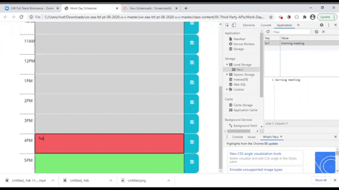
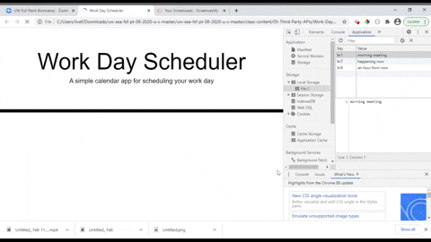

# Work-Day-Scheduler 

## Description
This is a simple work day scheduler where the user can enter events on a time block and save that event. The UI consists of time blocks from the 9AM hour to the 5PM hour and is color-coded whether the hour is past, current, or upcoming. This is possible using the moment.js library.

The UI is dynamically rendered using jQuery. Saved events persist made possible using local storage.

## Deployment / Repository
Repository is located [here](https://github.com/awpdev/work-day-scheduler).

## Table of Contents
* [Visuals](#visuals)
* [Usage](#usage)
* [Questions](#questions)
* [Credits](#credits)
* [License](#license)

## Visuals

## Usage

Enter an event/reminder in the appropriate text box and click on the disk icon to save your event/reminder.

## Questions
Please refer to my [Github](https://www.github.com/awpdev).

Also contact me via [email](mailto:apark999@gmail.com) with your inquiries.

## Credits
Here are some references I used that helped me create this:

Trilogy Education Services Full Stack Web Development Course examples
w3schools.com
https://stackoverflow.com/questions/10194728/jquery-click-event-works-only-once

## License
This project is under MIT.